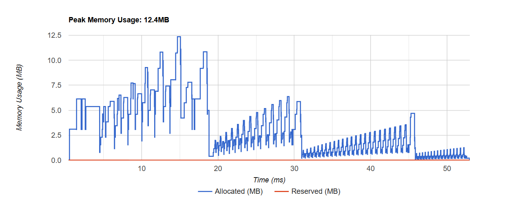
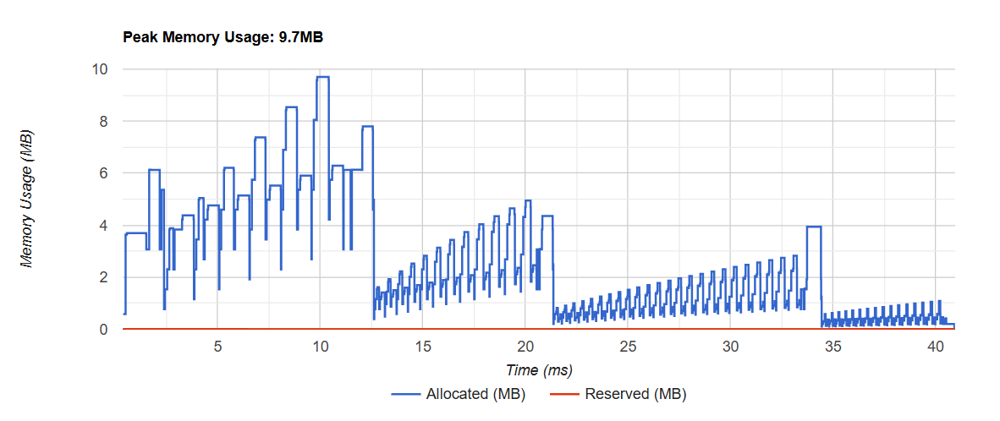

# Inference Performance Comparison: PyTorch channels_last vs Default (NCHW)

This document presents a detailed comparison of inference performance for two PyTorch torch.nn.Module models executed on CPU, one using channels_last memory format and the other using the default contiguous format.

The comparison is based on Torch profiler JSON outputs, evaluating both runtime latency and memory usage.

## Overview

PyTorch supports the channels_last memory format (NHWC) for models that benefit from optimized CPU kernels. This layout can improve performance for convolution-heavy models by enabling better vectorization and cache utilization.

This README summarizes:

* How profiling was performed

* Metrics extracted (time + memory)

* Comparison tables

* Observations and conclusions

## Hardware: 

CPU Device

PyTorch version: 2.9.1

Model: Pretrained Densenet121

Model type: torch.nn.Module

Input shape: 3,224,244  (C,H,W)

Profiler: torch.profiler.profile with JSON trace export

* Two experiments were conducted:

1. Default Contiguous Model

2. Channels Last Model (model = model.to(memory_format=torch.channels_last) and inputs converted accordingly)

* Profiling Method Used
        with profile(
                activities = [ProfilerActivity.CPU, ProfilerActivity.CUDA],
                profile_memory = True,
                record_shapes = False,
                on_trace_ready = torch.profiler.tensorboard_trace_handler("/profiler/"),
                with_stack = True
            ) as prof:

## Result & Summary

### Latency Comparison
1. Contiguous Memory Format          -    Avg 55 ms
2. Channels_last                     -    Avg 40 ms

### Peak Memory Consumption
1. Contiguous

2. Channels last
